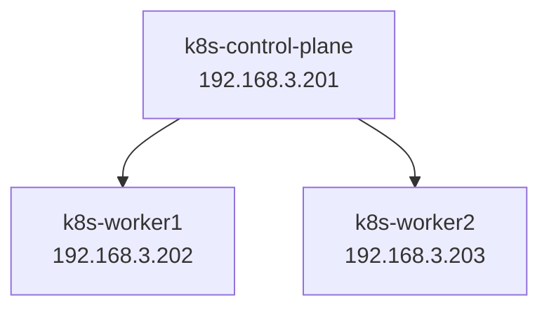

# Kubernetes_kubeadm_vagrant

 

Criação de uma infraestrutura local do Kubernetes com 01 Control Plane e 02 Workers.   
Será utilizado o Vagrant e o Kubeadm.    
O Sistema Operacional das VMs será o Debian 12.

 

